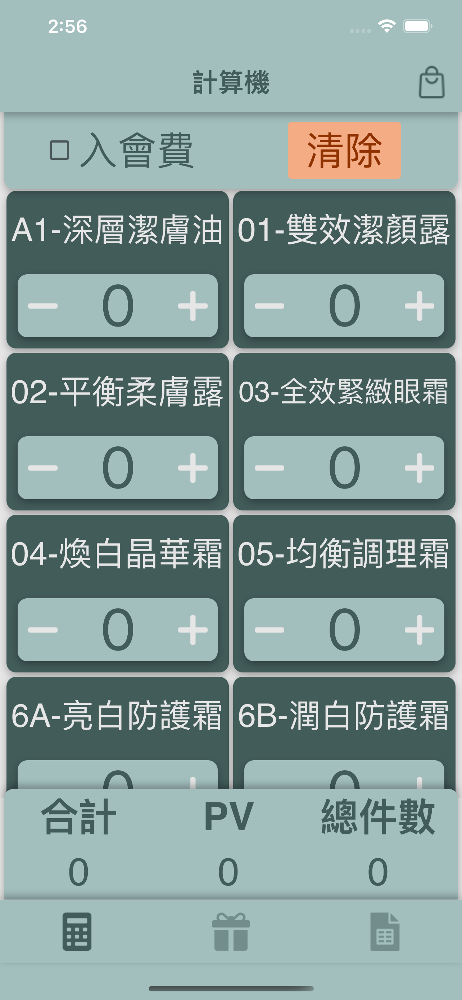
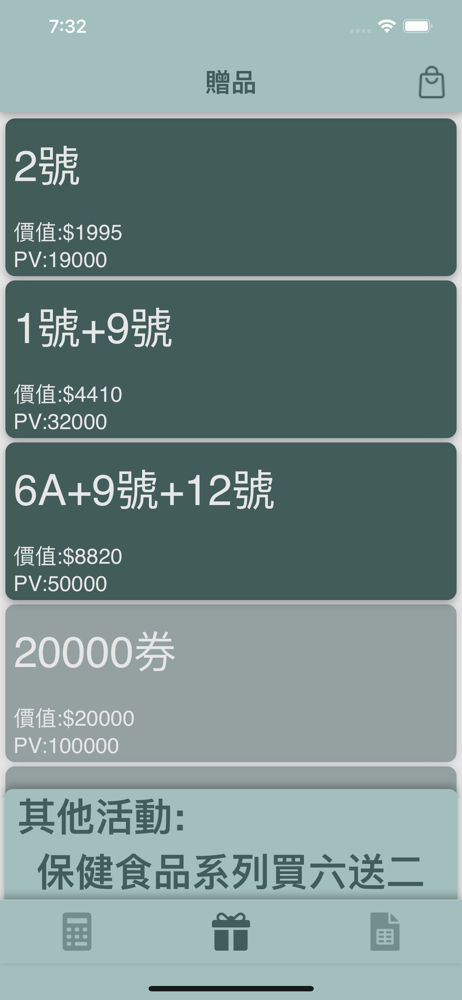
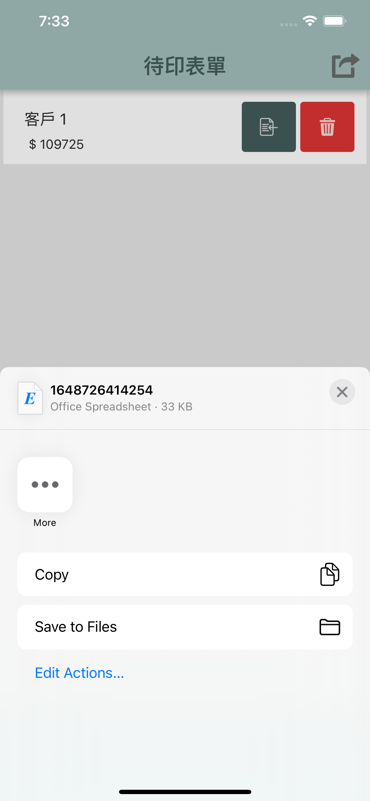

# TLHelper

TLHelper is a companion app for solving daily tasks easier.
Functionality:

- Calculating total price and PV (membership points) for [Ten Lead](https://tenlead.com/) products
- Export the orders to an Excel Spreadsheet.

## Built with

- React Native
  - using [Ignite boilerplate](https://github.com/infinitered/ignite)
  - React Navigation 6
  - MobX-State-Tree
  - Storybook
  - ExcelJS
- TypeScript
- Firebase

## Installation

[Google Play Store](https://play.google.com/store/apps/details?id=com.tlhelper)

[Apple App Store](https://apps.apple.com/tw/app/tlhelper/id1612050352)

## Screenshots

## Workflow

1. Adjust amount for each product.
2. Click bag icon on the top right to check current shopping bag.
3. After confirming current bag in dialog, add order to list.
4. Enter customer name.
5. To edit order, click the load order button to load into shopping bag and remove order from list. Click the delete order button to delete order.
6. When order list is ready, click the export button to share the generated Excel file.
7. Share the Excel file to Excel.
8. File is ready to be exported.
